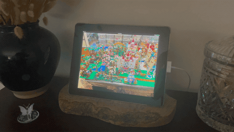

# iOS 9 WebKit Slideshow

[](https://github.com/wazam/ios9-webkit-slideshow/actions/workflows/docker.yml)
[](https://github.com/wazam/ios9-webkit-slideshow/actions/workflows/compose-test.yml)
[](https://github.com/wazam/ios9-webkit-slideshow/releases)
[](https://hub.docker.com/r/wazam123/ios9-webkit-slideshow)
[](https://hub.docker.com/repository/docker/wazam123/ios9-webkit-slideshow/general)
[](https://github.com/wazam/ios9-webkit-slideshow/pkgs/container/ios9-webkit-slideshow)

 **iOS 9 WebKit Slideshow** is a minimal, dependency-free photo slideshow built to run on genuinely old hardware: originally an iPad 3 (iOS 9.3.5, stuck on ancient Safari/WebKit) repurposed as a photo display. It's just plain HTML/CSS/JS (ES5) served by nginx, no frameworks, no `fetch()`, no ES6+ syntax, since modern JS tooling simply won't run on browsers this old: existing options like [ImmichFrame](https://github.com/immichFrame/immichFrame) and [PhotoShow](https://github.com/thibaud-rohmer/PhotoShow) both failed on iOS 9 Safari (a frontend that couldn't run at all, and a slideshow button that silently did nothing). Ancient problems require modern solutions.

## Table of Contents

- [Demo](#demo)
- [Features](#features)
- [Quick Start](#quick-start)
  - [Run via Docker](#run-via-docker)
  - [Build from Source](#build-from-source)
  - [Adding Photos](#adding-photos)
  - [Read-Only Photo Library](#read-only-photo-library)
- [Environment Variables](#environment-variables)
- [How It Works](#how-it-works)
- [Compatibility Notes](#compatibility-notes)
- [Companion Tools](#companion-tools)
- [License](#license)

## Demo



The physical setup, crossfading between two photos on the iPad 3.

## Features

- **Smooth transitions**: photos fade from one to the next, loading quietly in the background first so there's no stutter or flash
- **Handles broken and missing photos gracefully**: a photo that fails to load is skipped automatically, and if there are no photos at all it shows a friendly message instead of a black screen
- **Organize however you like**: photos in subfolders all play together in one shared rotation, no matter how you nest them, and any folder named `ignore` is hidden from the rotation without deleting anything
- **Shuffle or in order**: show photos in random order or alphabetically, your choice
- **No manual photo conversion**: drop `.heic` photos straight from your iPhone into the shared folder (however you already access it, like a network share or a file browser app) and they're automatically converted and added to the slideshow, no separate conversion step needed
- **Plugs into monitoring tools**: a built-in health check lets tools like Portainer tell if it's actually still working
- **No permission headaches**: matches your own user account automatically, so nothing ever needs manual permission fixes

## Quick Start

> [!TIP]
> Run via Docker is recommended for most users. No clone required.

**Required setup:** the container writes into `pictures/` (to process `_inbox/` drops), so set `PUID`/`PGID` to match whoever owns your `pictures/` folder on the host (find yours with `id -u` and `id -g`; the default `1000` already matches the first user account on most single-user Linux/WSL setups). Once they match, the container and your own account always have full access to anything either side creates, no `chmod` ever needed, even for brand-new folders created later by a file manager or a family member organizing `_inbox/` drops into subfolders.

### Run via Docker

The image is published to [GitHub Container Registry](https://github.com/wazam/ios9-webkit-slideshow/pkgs/container/ios9-webkit-slideshow) (`ghcr.io/wazam/ios9-webkit-slideshow`) and [Docker Hub](https://hub.docker.com/r/wazam123/ios9-webkit-slideshow) (`wazam123/ios9-webkit-slideshow`).

1. **Create the pictures directory**

   ```sh
   mkdir pictures
   ```

2. **Download the compose file**

   ```sh
   curl -O https://raw.githubusercontent.com/wazam/ios9-webkit-slideshow/main/compose.yaml
   ```

   The compose file looks like this. Uncomment and set `PUID`/`PGID` per the required setup above, and adjust any other settings as needed:

   ```yaml
   services:
     app:
       image: ghcr.io/wazam/ios9-webkit-slideshow:latest
       container_name: slideshow
       restart: unless-stopped
       # environment:
       #   - PUID=1000
       #   - PGID=1000
       #   - INBOX_SCAN_SECONDS=30
       #   - SERVER_SCAN_SECONDS=60
       #   - BROWSER_REFRESH_MINUTES=15
       #   - SLIDESHOW_DELAY_SECONDS=10
       #   - SLIDESHOW_SHUFFLE=true
       volumes:
         - ./pictures:/usr/share/nginx/html/pictures
         # - /path/to/your/existing/photos:/usr/share/nginx/html/pictures/external:ro
       ports:
         - 8080:8080
   ```

3. **Start the stack**

   ```sh
   docker compose up -d
   ```

4. **Open the slideshow**

   Visit `http://<host>:8080` in your browser.

---

### Build from Source

1. **Clone the repository**

   ```sh
   git clone https://github.com/wazam/ios9-webkit-slideshow.git
   cd ios9-webkit-slideshow
   ```

2. **Build and start the stack**

   `compose.override.yaml` swaps in a local `ios9-webkit-slideshow:local` tag and adds the `build: .` step, so a local build never overwrites the published GHCR image. This file auto-merges with `compose.yaml` on any plain `docker compose` command, no extra flags needed:

   ```sh
   docker compose up -d --build
   ```

   For faster iteration while actively developing, layer on `compose.dev.yaml` too, which shortens the slideshow/scan/refresh timings so changes show up in seconds instead of minutes (specifying any `-f` flags disables the automatic `compose.override.yaml` merge, so it has to be listed explicitly alongside the others):

   ```sh
   docker compose -f compose.yaml -f compose.override.yaml -f compose.dev.yaml up -d --build
   ```

3. **Open the slideshow**

   Visit `http://<host>:8080` in your browser.

### Adding Photos

Add or remove photos by dropping files into the `pictures/` folder (bind-mounted from the host). No restart is required: the server rescans within `SERVER_SCAN_SECONDS`, then the browser picks up the updated list on its next reload, within `BROWSER_REFRESH_MINUTES`.

To add photos straight from an iPhone (or any format) without any conversion step, drop them into `pictures/_inbox/` (organize into subfolders there if you want; they land in the matching subfolder under `pictures/`, e.g. `pictures/_inbox/vacation2026/photo.heic` becomes `pictures/vacation2026/photo.jpg`). This is also why a GUI file manager like FileBrowser is optional rather than required: plain filesystem/network access to `pictures/_inbox/` is enough. The leading underscore is deliberate, it sorts the folder to the top of most file managers (FileBrowser, Windows Explorer, `ls`, etc.), ahead of `ignore/` and any of your own photo folders, so it's easy to find at a glance.

### Read-Only Photo Library

If you already have a photo library elsewhere and don't want or need the inbox/HEIC-conversion feature, mount it read-only instead by adding `:ro` to the volume line in `compose.yaml`:

```yaml
volumes:
  - /path/to/your/existing/photos:/usr/share/nginx/html/pictures:ro
```

This works with any host path, not just `pictures/` in this repo. `PUID`/`PGID` don't need to match anything in this mode either, since the container never writes to a read-only mount. There's nothing else to set up: the inbox feature simply does nothing, since it only acts if a `pictures/_inbox/` folder exists, so a plain read-only library with no such folder is left untouched (no errors, no write attempts). `ignore/` folders still work identically either way. The trade-off: a `.heic` file dropped straight into a read-only-mounted folder is simply never picked up, since there's no inbox to convert it and the scanner only recognizes already-supported image formats.

You don't have to choose one or the other: an existing library can also be mounted read-only *alongside* the managed `pictures/` tree, nested at a subpath instead of replacing the mount entirely. Uncomment the second `volumes` line in `compose.yaml` and set the host path:

```yaml
volumes:
  - ./pictures:/usr/share/nginx/html/pictures
  - /path/to/your/existing/photos:/usr/share/nginx/html/pictures/external:ro
```

The read-only library then shows up in the slideshow like any other subfolder, merged into the same photo pool, but the inbox/HEIC feature can never write into it since that specific mount point is read-only.

## Environment Variables

| Variable | Description | Default |
|---|---|---|
| `PUID` | Host user ID the container runs as. Should match whoever owns `pictures/` (check with `id -u`) | `1000` |
| `PGID` | Host group ID the container runs as. Should match whoever owns `pictures/` (check with `id -g`) | `1000` |
| `INBOX_SCAN_SECONDS` | How often `pictures/_inbox/` is checked for newly dropped photos to convert/move/dedupe | `30` |
| `SERVER_SCAN_SECONDS` | How often the server rescans the `pictures/` folder and rewrites `photos.js` | `60` |
| `BROWSER_REFRESH_MINUTES` | How often the browser reloads the page to pick up new/removed photos | `15` |
| `SLIDESHOW_DELAY_SECONDS` | How many seconds each photo stays on screen before crossfading to the next | `10` |
| `SLIDESHOW_SHUFFLE` | `true` = random photo order, reshuffled each full cycle, guaranteed never to repeat the same photo twice in a row (unless only one photo exists); `false` = alphabetical path order (folders sort together, files uploaded later don't jump ahead of other folders) | `true` |

## How It Works

- `Dockerfile` builds a custom image on top of `nginxinc/nginx-unprivileged:alpine`, with the slideshow page and a photo-scanning script baked in. The container starts as root only long enough to adjust its internal user to match `PUID`/`PGID`, then drops privileges permanently before running anything else
- On container start (and on a repeating interval), `generate-photos.sh` scans the mounted `pictures/` folder and writes out `photos.js`, a plain JS array of image paths
- `index.html.template` is processed by nginx's built-in `envsubst` templating on startup, substituting environment variables into the page before serving it
- `process-inbox.sh` runs immediately before the photo scan on each interval, converting and moving anything dropped into `pictures/_inbox/` (deduplicated by content hash, filename collisions auto-renamed) so it's already in place by the very next scan

## Compatibility Notes

- Tested working on iOS 9.3.5 Safari (iPad 3) and modern desktop browsers
- The photo scanner only picks up `.jpg`/`.jpeg`, `.png`, and `.gif` (including animated GIFs). All three have been supported since the earliest iOS releases, and are confirmed working on iOS 9.3.5 Safari
- `.webp` is deliberately excluded: Safari didn't add WebP support until Safari 14 / iOS 14
- `.bmp` is also excluded: it renders fine on modern desktop browsers, but was tested and does not render on iOS 9.3.5 Safari
- Photos only, video is not supported. `.mp4`/H.264 was tested and doesn't render reliably on iOS 9 Safari, since `playsinline` support wasn't added until iOS 10
- `.mov` files hit the same `playsinline` problem if they contain H.264, which is true of most consumer `.mov` exports; the blocker is the missing browser feature, not the container format
- `.webm` isn't supported at all: Safari has never had native WebM support
- HEVC/H.265 (in either container) fails even more fundamentally: iOS didn't add HEVC decoding until iOS 11, and only on A9-chip-or-later devices. The iPad 3's A5X chip predates that requirement entirely, so the codec itself can't be decoded, not just blocked by the `playsinline` issue
- The photo scanner doesn't pick up video files of any format regardless

## Companion Tools

A file-manager container (e.g. [FileBrowser](https://github.com/gtsteffaniak/filebrowser) or [Dufs](https://github.com/sigoden/dufs)) pointed at the same `pictures/` folder is optional, not required: `pictures/_inbox/` (see Quick Start above) handles adding and converting photos on its own. A GUI file manager is only useful if you also want to browse, rename, or delete existing photos without direct filesystem/network access. Not included in this repo, deployed alongside it if wanted.

## License

This project is licensed under the [MIT License](LICENSE).
